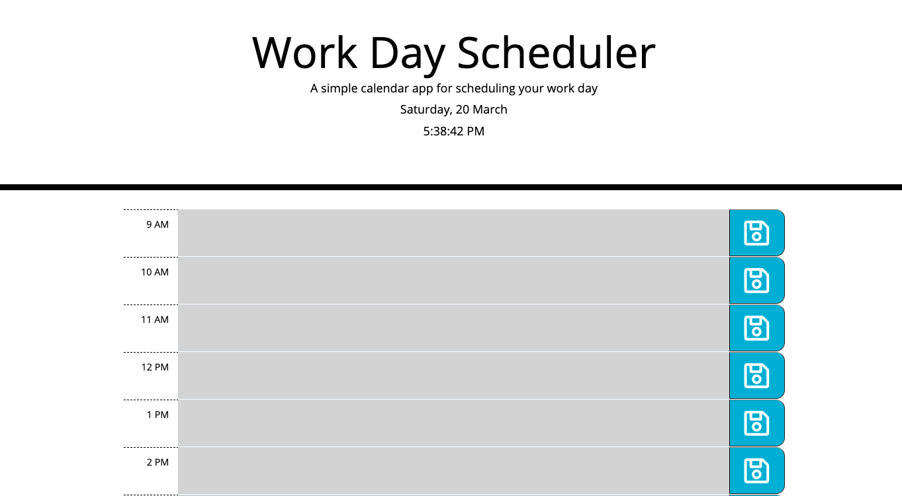
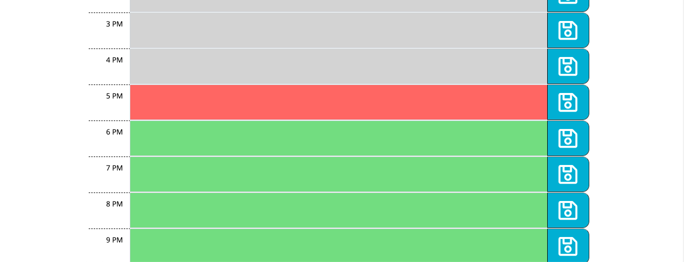

# 05 Third-Party APIs: Work Day Scheduler

## Description

In this assignment we were tasked with creating a scheduler for the workday that indicates the current date at the top and where the user can add events for each hour of the day and save these events to local storage. Also this scheduler indicates by color, whether the time was in the past or is in the present or future. For fun, I also added the time in seconds for the users convenience.   

## Links

Deployed URL:https://ashak90.github.io/05-work-day-scheduler/

## Screnshots

 
 

